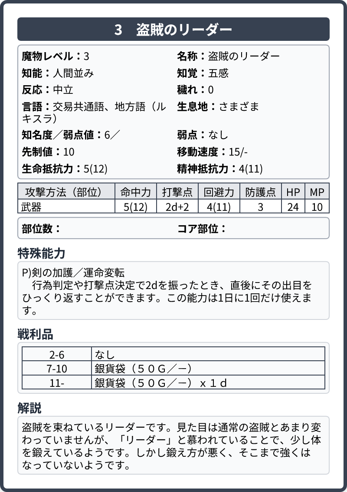

# ソードワールド2.5 魔物データ生成ツール

ソードワールド2.5用の魔物データを簡単に作成できるWebアプリケーションです。

## 🔗 アプリケーションURL

**https://delta-time.github.io/sw25-monster-generator/**

## 📋 機能

- 魔物の基本データ（レベル、名称、知能、知覚など）の入力
- 攻撃方法の詳細設定（複数部位対応）
- 特殊能力、戦利品、解説の記述
- リアルタイムプレビュー表示
- PNG画像としての出力機能
- データの保存・読み込み機能（JSON形式）

## 📸 サンプル画像

こんなやつを作れるツール。

## 🚀 使い方

1. [アプリケーション](https://delta-time.github.io/sw25-monster-generator/)にアクセス
2. 左側のフォームに魔物データを入力
3. 右側でリアルタイムプレビューを確認
4. 「画像として出力」ボタンで PNG ファイルをダウンロード
5. 必要に応じて「データ保存」でJSONファイルとして保存

## 🛠️ 技術スタック

- Vue 3
- TypeScript
- Vite
- Tailwind CSS
- html-to-image
